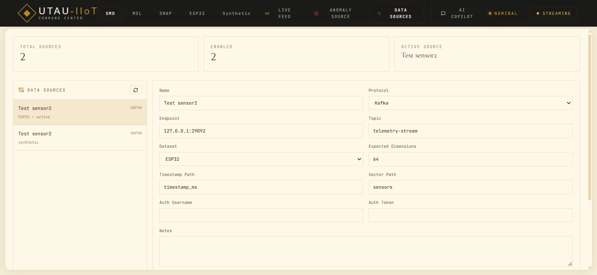
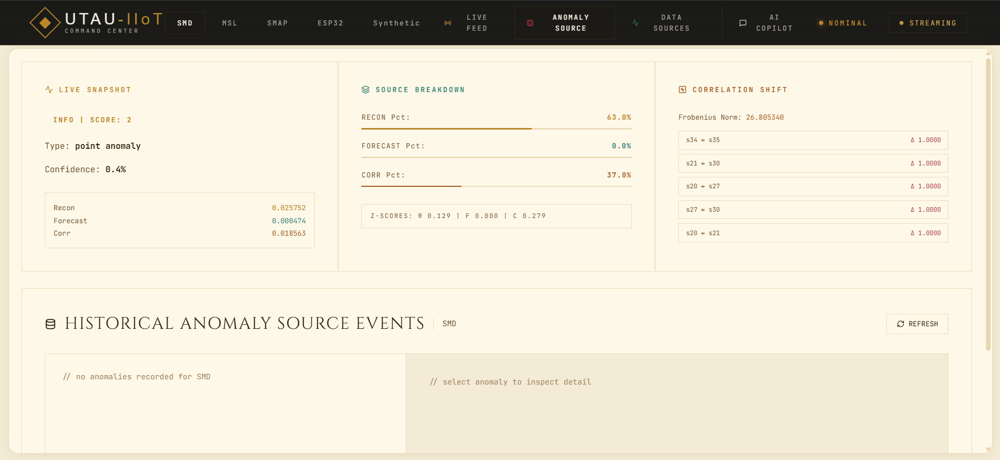
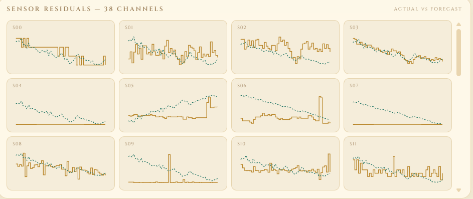

# UTAU-IIoT – Spatio-Temporal Predictive Transformer for Anomaly Detection
**Custom Neural Network Architecture, Real-Time Streaming Telemetry, AI Copilot & ESP32 Integration**


**Features** • **Demo** • **Installation** • **Architecture** • **API**

---

## 🏗️ Architecture Diagram

**System Architecture**  
Our custom Neural Network architecture outperforms SOTA baseline architectures like TranAD, GDN, etc., for time-series anomaly detection.


---

## 🖼️ UI Screenshots & Features

### 1. Command Center & Dashboard
**Homeland Gateway**  
A high-tech, industrial-grade landing experience acting as the gateway to your live sensor hub.


### 2. Live Telemetry Analytics
**Real-Time Dashboarding**  
Track real-time anomalies, fused scoring, and correlation shifts simultaneously across synthetic datasets or live hardware.
<table>
  <tr>
    <td></td>
    <td></td>
  </tr>
  <tr>
    <td></td>
    <td></td>
  </tr>
</table>

### 3. UTAU AI Copilot
**Cybernetic Agent Assistant**  
Interact directly with your industrial anomaly data using an advanced AI Copilot powered by LLMs (Groq). Ask for diagnostic insights, analyze historical operator feedback, and request active mitigation strategies right from the interface.


### 4. SOTA Benchmark Scores
**Performance Proof**  
Empirically validated performance against industry standard datasets.


---

## 🎯 System Overview

This project is a State-of-the-Art (SOTA) streaming anomaly detection platform built around a novel **Spatio-Temporal Predictive Transformer**. It bridges the gap between raw hardware telemetry (ESP32) and high-level autonomous governance, providing a closed-loop system for predicting, explaining, and mitigating industrial equipment failure.

## 🚀 What It Does

- **Real-Time AI Inference**: Fused scoring combining reconstruction loss, forecasting error, and correlation-shift measurements via PyTorch.
- **UTAU AI Copilot**: Uses Groq LLM reasoning to explain complex, multi-variate anomalies based on the actual live system context and database operator feedback.
- **WhatsApp Pager Alerts**: Built-in Twilio integration immediately alerts operators via WhatsApp when critical threshold deviations happen natively from the backend.
- **ESP32 Edge Integration**: End-to-end hardware pipeline from physical ESP32 sensors over MQTT to Kafka to the neural network backend.
- **Live WebSocket Engine**: The React UI renders fast, high-density graphs updating dynamically without refreshing, visualizing 64+ dimensions concurrently.
- **Adaptive Policy Governance**: Built-in RL (Reinforcement Learning) suggestions, operator feedback loops, and guarded model re-calibration to adapt to concept drift.

---

## 📊 Performance & Technologies

### Component Breakdown
```text
┌─────────────────────────────────────────────────────────────┐
│  USER DASHBOARD: "Interactive Web UI & Operator Panels"     │
└─────────────────────────────────────────────────────────────┘
                         │ 
                         ▼ (WebSockets / HTTP)
┌─────────────────────────────────────────────────────────────┐
│  FASTAPI SERVICES (Python)                                  │
│  - WebSocket Live Stream Telemetry Sync                     │
│  - Policy Governance & Model Hot-Swapping                   │
│  - Twilio WhatsApp Integration (Alerts)                     │
└─────────────────────────────────────────────────────────────┘
                         │ 
                         ▼ (Data Feed)
┌─────────────────────────────────────────────────────────────┐
│  DATA PROCESSING / AI ENGINE                                │
│  - Custom Spatio-Temporal Transformer (PyTorch)             │
│  - UTAU AI Copilot powered by Groq Llama3                   │
│  - Kafka Streaming Consumer & InfluxDB Persistence          │
└─────────────────────────────────────────────────────────────┘
                         │
                         ▼ (Hardware / Ingestion)
┌─────────────────────────────────────────────────────────────┐
│  EDGE LAYER                                                 │
│  - ESP32 Hardware Telemetry via MQTT                        │
│  - Synthetic Dataset Simulators                             │
└─────────────────────────────────────────────────────────────┘
```

### Key Technologies
- **Frontend**: React (Vite), Framer Motion (premium animations), Recharts, Lucide Icons.
- **Backend**: FastAPI (Python), Uvicorn, WebSockets.
- **AI / Deep Learning**: PyTorch (STP-TranAD model), Groq API (Copilot).
- **Messaging / Ingest**: Apache Kafka, Mosquitto (MQTT), Twilio (Alerts).
- **Storage**: SQLite (Governance/Feedback), InfluxDB (Time-series persistence).

---

## ⚙️ Installation & Setup

### Prerequisites
- Windows / Linux
- Python 3.10+ (Conda environment recommended)
- Node.js 18+
- Docker Desktop (for Kafka & InfluxDB)
- Groq API Key & Twilio API Keys (If using Copilot & Pager)

### 1. Infrastructure Setup
From the repository root:
```bash
docker compose up -d kafka

# Optional for local MQTT/ESP32:
docker run -d --name catch-mosquitto -p 1883:1883 eclipse-mosquitto:2
```

### 2. Backend Setup
```bash
cd TranAD-main

# Create environment
conda create -n tranad python=3.10
conda activate tranad
pip install -r requirements.txt

# Start Backend Server
set KAFKA_CONSUMER_ENABLED=true
set KAFKA_BOOTSTRAP_SERVERS=127.0.0.1:29092
set KAFKA_TOPIC=telemetry-stream
python server.py
```
*The API runs on http://127.0.0.1:8000*

*(Optional) Start Kafka Data Simulator in a new terminal:*
```bash
cd TranAD-main
conda activate tranad
python kafka_producer.py --dataset synthetic --topic telemetry-stream --hz 2 --loop
```

### 3. Frontend Setup
```bash
cd Frontend

npm install
npm run dev
```
*The App runs on http://localhost:5173*

---

## 🔌 API Endpoints (Snapshot)

### Core Streaming & Model Ops
| Method | Endpoint | Description |
|---|---|---|
| `POST` | `/ingest` | Direct HTTP data ingestion alternative to Kafka |
| `WS` | `/ws/stream` | Primary WebSocket live output of telemetry vectors |
| `GET` | `/status` | Complete engine state, ingested counts, and active policies |
| `POST` | `/change_dataset` | Hot-swap datasets and initialize specific model weights |

### Governance & Notifications
| Method | Endpoint | Description |
|---|---|---|
| `POST` | `/feedback` | Log operator resolutions & annotations to SQLite |
| `GET` | `/api/feedback_history` | Retrieve context mapping for the AI Copilot |
| `POST` | `/api/whatsapp/test` | Trigger Twilio pager workflow via API |

### RL Policy (Feature Gated)
| Method | Endpoint | Description |
|---|---|---|
| `GET` | `/policy/suggest` | Calculate dynamic thresholds via RL |
| `POST` | `/policy/apply` | Admin override for threshold adjustments with canary check |

---

## 📜 License
This project utilizes and builds securely upon the base TranAD implementation. Please refer to upstream TranAD publications for model attribution context. Ensure appropriate credentials are used per the LICENSE.

## 🙏 Acknowledgments
- **Groq** for high-speed anomaly explanation generation.
- **Twilio** for robust physical-world pager integration.
- Foundational Transformer time series researchers.
