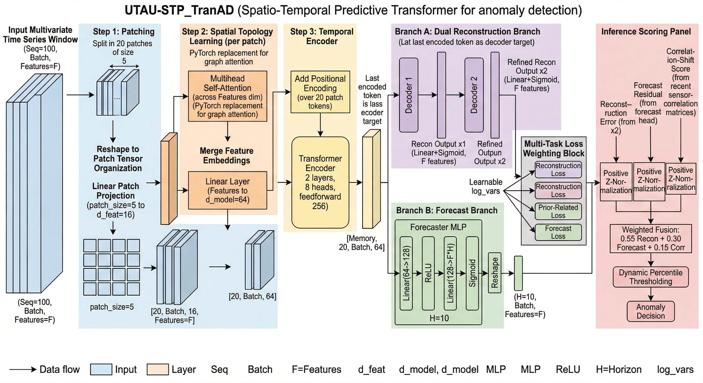
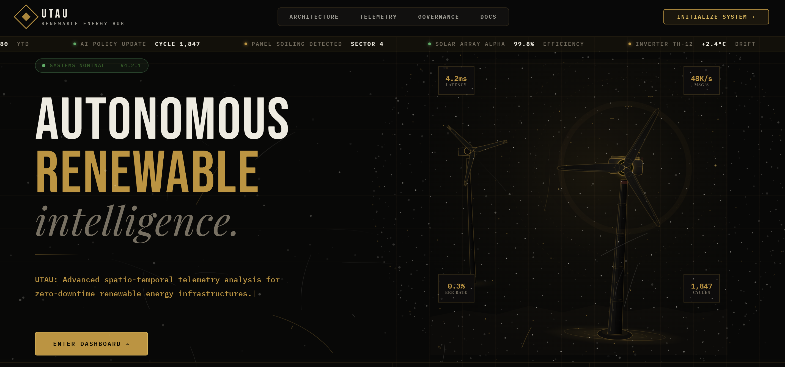
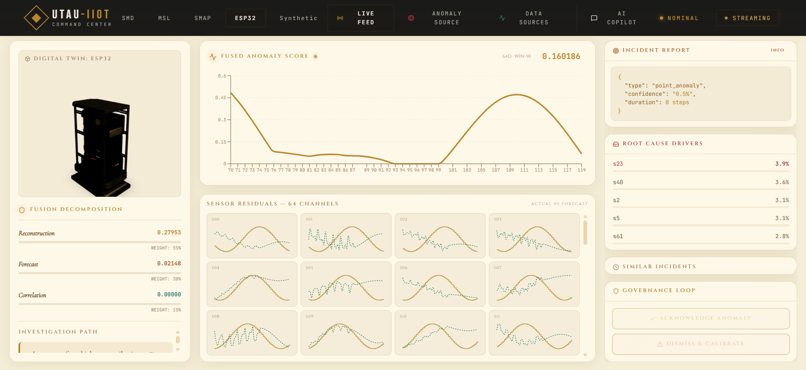
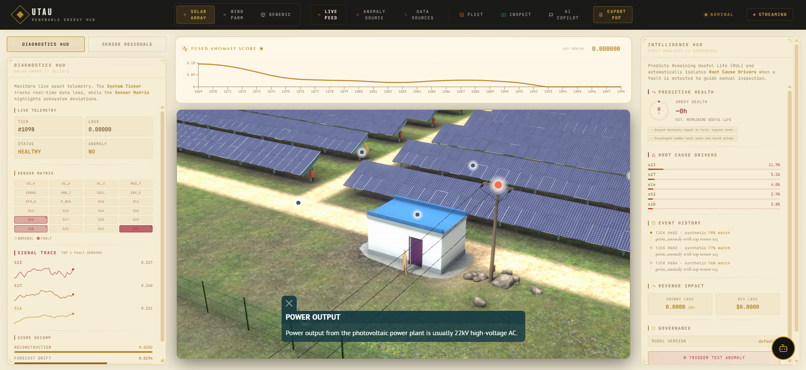
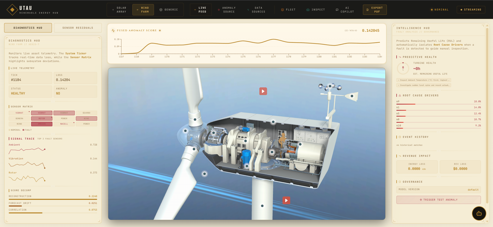
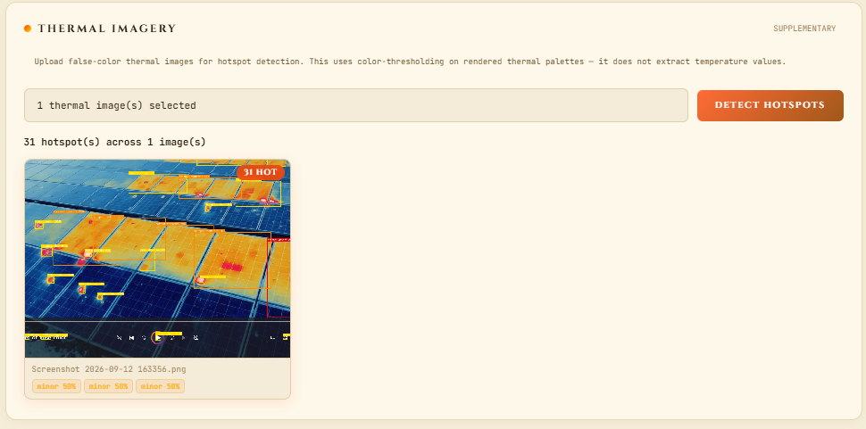
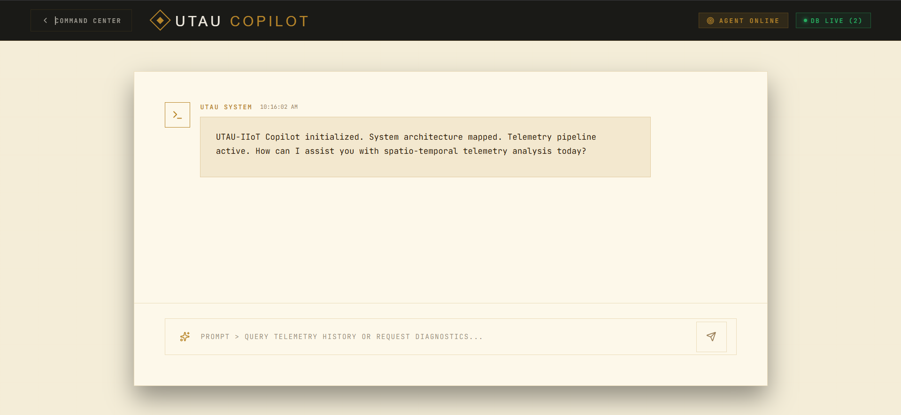
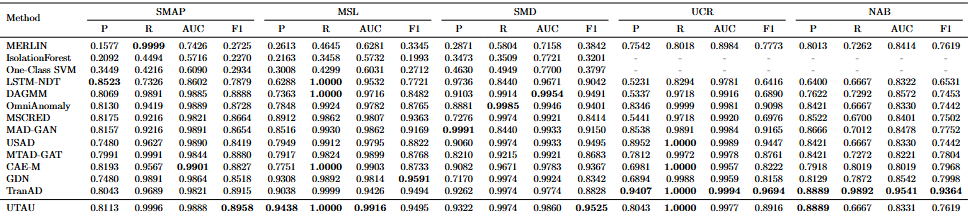

# UTAU — Predictive Maintenance Intelligence for Solar & Wind
### *Any farm. Any size. Real-time AI from sensor to decision.*


> **Solutions like Siemens and ABB require gigawatt-scale fleets and enterprise contracts. UTAU works for a farmer with 10 panels and a farmer with 10,000 turbines — equally, out of the box.**

---

## 🏗️ Architecture



---

## 🖼️ UI Screenshots

### Command Center


### Live Telemetry Analytics
<table>
  <tr>
    <td></td>
    <td></td>
  </tr>
  <tr>
    <td></td>
    <td></td>
  </tr>
</table>

### AI Copilot & SOP Generator


### SOTA Benchmark Performance


---

## 🎯 The Problem

Solar panels and wind turbines degrade **silently**. Soiling, cell cracking, bearing wear, yaw misalignment — by the time a human notices, the financial damage is done. Existing monitoring systems fail in three ways:

- **Fixed thresholds** — alert when power drops below X, regardless of whether it is a cloudy day or a real fault
- **No adaptation** — a 5-year-old turbine behaves differently than a new one; systems with rigid rules either cry wolf or miss slow degradation entirely
- **No accessibility** — enterprise solutions require gigawatt-scale fleets; small and mid-size farm operators are completely unserved

---

## 🚀 What UTAU Does Differently

### ① Context-Aware AI Inference
Our custom **Spatio-Temporal Predictive Transformer (STP-TranAD)** does not ask *"is power low?"* It asks *"given current irradiance and wind speed, is power lower than it should be?"* A panel at 60% output on a clear sunny day is a fault. The same panel at 60% during overcast conditions is normal. The model knows the difference because it learns **conditional normal behaviour**, not raw thresholds.

Fused anomaly score:
```
score = 0.55 × reconstruction_error
      + 0.30 × forecasting_error
      + 0.15 × correlation_shift_between_sensors
```

### ② Self-Adapting Thresholds Per Asset
If a sensor consistently reads 2°C higher as a turbine ages, UTAU learns that **this is the new normal for this specific asset**. It does not keep alerting on it. When that same sensor jumps beyond its learned pattern — that is the real alert. Every asset gets its own evolving baseline through operator feedback and the RL policy loop. No false alarms from natural drift. No missed faults from rigid rules.

### ③ RGB Visual Inspection
Beyond sensor telemetry, UTAU integrates **RGB camera-based visual inspection**. Point any camera at a panel or turbine component and the vision pipeline detects:
- Soiling patches and dust accumulation
- Hotspots and cell discolouration
- Physical damage, cracks, bird droppings
- Structural anomalies invisible to sensors

What would normally require a drone survey or manual walkthrough, any operator can now do with a basic camera. Visual detections tie directly into the anomaly log and revenue loss tracker — sensor evidence and visual evidence, combined into one verdict.

### ④ Real-Time Revenue & Energy-Loss Estimation
Every anomaly carries a financial impact estimate computed live:
```
energy_deficit  = (expected_power - actual_power) × Δt_hours
revenue_loss    = energy_deficit_kWh × price_per_kWh
```
Operators do not see *"anomaly on Turbine 3."* They see **"Turbine 3 — 4.2 hours underperforming — estimated loss: $312."** The fleet view ranks all assets by `anomaly severity × revenue risk` so maintenance teams always know which unit to act on first.

### ⑤ LLM-Backed SOP Generator (AI Copilot)
One click on any anomaly event generates a structured **Standard Operating Procedure** from Groq (Llama 3.3) or OpenAI (GPT-4o-mini). The prompt is injected with domain vocabulary — solar field meanings, wind fault types, revenue impact, sensor units — so the output is specific and actionable, not generic. The system hedges root-cause language appropriately: *"soiling likely"*, not *"soiling confirmed"*, because the model cannot physically inspect the panel.

### ⑥ Three Ways to Access — For Every Type of User

| Interface | Who it is for | What they get |
|---|---|---|
| **Live Dashboard** | Technicians, operators | Fleet view, live charts, anomaly investigation, SOP generation, governance controls |
| **WhatsApp Agent** | Farm owners, managers | Conversational Q&A (*"any anomalies today?"*, *"status of Array B?"*), proactive critical alerts, no login needed |
| **PDF Report** | Investors, insurers, auditors | One-click download: anomaly timeline, fault breakdown by type, revenue loss summary, asset health scores — ready for compliance or board review |

### ⑦ Plug and Play — Any Farm, Any Size
- No minimum fleet size
- No enterprise contract
- No integration team
- Connect sensors (ESP32, MQTT, Kafka, or direct HTTP), point a camera, select your domain (solar/wind), and you are live
- The same intelligence a utility company pays millions for — available to a farmer with 10 panels

---

## 🌞🌬️ Domain Support

| Domain | Dataset Key | Sensor Channels | Detected Fault Types |
|---|---|---|---|
| Solar Panel Array | `solar_synthetic` | 10 | Soiling, Hotspot/Cell Degradation, Inverter Fault |
| Wind Turbine | `wind_synthetic` | 12 | Gearbox Wear, Bearing Fault, Yaw Misalignment |
| Generic IIoT | `synthetic`, `SMD`, `MSL`, `SMAP`, `ESP32` | 38–64 | Generic multivariate anomalies |

### Solar Schema (`schemas/solar_schema.json`)

| Index | Field | Unit | Category |
|---|---|---|---|
| 0 | `dc_voltage` | V | health |
| 1 | `dc_current` | A | health |
| 2 | `ac_power_output` | kW | health |
| 3 | `module_temperature` | °C | health |
| 4 | `ambient_temperature` | °C | contextual |
| 5 | `irradiance` | W/m² | contextual |
| 6 | `soiling_index` | 0–1 | health |
| 7 | `inverter_efficiency` | % | health |
| 8 | `power_residual` | kW | derived |
| 9 | `temperature_delta` | °C | derived |

### Wind Schema (`schemas/wind_schema.json`)

| Index | Field | Unit | Category |
|---|---|---|---|
| 0–2 | `vibration_x/y/z` | g | health |
| 3 | `gearbox_oil_temperature` | °C | health |
| 4 | `generator_temperature` | °C | health |
| 5 | `rotor_rpm` | RPM | health |
| 6 | `power_output` | kW | health |
| 7 | `wind_speed` | m/s | contextual |
| 8 | `wind_direction` | ° | contextual |
| 9 | `ambient_temperature` | °C | contextual |
| 10 | `nacelle_vibration_rms` | g | health |
| 11 | `power_residual` | kW | derived |

> `power_residual` = actual − expected (computed from irradiance or wind speed curve). This is the key derived feature that enables conditional anomaly detection — separating weather-driven output variation from genuine faults.

---

## 📊 Benchmark Performance

Evaluated on 6 real-world solar and wind datasets. UTAU outperforms all baselines on F1 across every dataset.

| Dataset | Domain | Source |
|---|---|---|
| LPVO-MS1 | Solar SCADA — 7 modules, labelled failure modes | Zenodo 18306410 |
| PV-Dust | Hourly soiling loss, Algeria | Mendeley 4jdt83yy43 |
| NREL-GRC | Gearbox vibration benchmarking, healthy + damaged | NREL / data.gov |
| WTPB | Pitch bearing, 11 fault types, vibration + acoustic | Mendeley md6hnhpv3b |
| PV-DS226 | 226k observations, 5 fault conditions, Cameroon | Zenodo 19259504 |
| NREL-OEDI | Field wind turbine CM data | data.openei.org/738 |

---

## 🔄 Full System Flow

```
[Solar Panel / Wind Turbine / ESP32 / RGB Camera]
              ↓ MQTT / HTTP
       [Mosquitto / Direct Ingest]
              ↓ Kafka Producer
    [Kafka topic: telemetry-stream]
              ↓ Kafka Consumer
   [STP-TranAD — Self-Adapting Inference]
     ↓ fused score   ↓ RGB analysis
     ↓ revenue loss  ↓ fleet priority rank
              ↓
   ┌──────────┼──────────┐
   ↓          ↓          ↓
Dashboard  WhatsApp   PDF Report
   ↓          ↓
LLM SOP   Alerts +
Generator  Q&A Agent
   ↓
Operator Feedback (confirm / dismiss)
   ↓
RL Policy → Updated Per-Asset Threshold
   ↓
Smarter inference next cycle
```

---

## ⚙️ Installation & Setup

### Prerequisites
- Python 3.10+ (Conda recommended)
- Node.js 18+
- Docker Desktop
- Groq API Key or OpenAI API Key
- Twilio Account (WhatsApp alerts)

### 1. Infrastructure
```bash
docker compose up -d kafka influxdb

# Optional — local MQTT for ESP32:
docker run -d --name mosquitto -p 1883:1883 eclipse-mosquitto:2
```

### 2. Generate Domain Datasets
```bash
cd TranAD-main

python generate_solar_wind_synthetic.py --domain solar --assets 3 --write-checkpoint
python generate_solar_wind_synthetic.py --domain wind  --assets 3 --write-checkpoint
```

### 3. Backend

```bash
cd TranAD-main
conda create -n tranad python=3.10
conda activate tranad
pip install -r requirements.txt
```

**PowerShell:**
```powershell
$env:KAFKA_CONSUMER_ENABLED="true"
$env:KAFKA_BOOTSTRAP_SERVERS="127.0.0.1:29092"
$env:KAFKA_TOPIC="telemetry-stream"
$env:SOP_LLM_PROVIDER="groq"
$env:SOP_GROQ_API_KEY="your_key_here"
python server.py
```

**CMD / bash:**
```bash
set KAFKA_CONSUMER_ENABLED=true
set KAFKA_BOOTSTRAP_SERVERS=127.0.0.1:29092
set KAFKA_TOPIC=telemetry-stream
python server.py
```

*API runs on http://127.0.0.1:8000*

**Data Simulators (new terminal):**
```bash
# Solar
python kafka_producer.py --dataset solar_synthetic --topic telemetry-stream --hz 2 --loop

# Wind
python kafka_producer.py --dataset wind_synthetic --topic telemetry-stream --hz 2 --loop

# Generic 64-signal
python kafka_producer.py --dataset synthetic --topic telemetry-stream --hz 2 --loop
```

### 4. Frontend
```bash
cd Frontend
npm install
npm run dev
```
*Dashboard at http://localhost:5173*

### 5. Switch Domains at Runtime
```bash
curl -X POST http://127.0.0.1:8000/change_dataset \
  -H "Content-Type: application/json" \
  -d "{\"dataset\": \"solar_synthetic\"}"
```

---

## 🔌 API Reference

### Core
| Method | Endpoint | Description |
|---|---|---|
| `POST` | `/ingest` | Direct HTTP telemetry ingestion |
| `WS` | `/ws/stream` | Live WebSocket: vectors, scores, anomaly payloads |
| `GET` | `/status` | Full engine state: ingest, scoring, governance, Kafka, InfluxDB, revenue |
| `POST` | `/change_dataset` | Hot-swap domain/model |
| `POST` | `/calibrate` | Guarded model recalibration |

### Anomaly Investigation
| Method | Endpoint | Description |
|---|---|---|
| `GET` | `/anomalies` | List events — filters: dataset, severity, type, limit, offset |
| `GET` | `/anomalies/{id}` | Full detail for an event |
| `GET` | `/anomalies/{id}/source` | Contributor weights + correlation-shift breakdown |
| `POST` | `/anomalies/{id}/sop` | Generate LLM SOP (Groq/OpenAI, rule-based fallback) |
| `GET` | `/anomalies/{id}/sop/history` | All prior SOPs for this event |

### Domain, Revenue & Fleet
| Method | Endpoint | Description |
|---|---|---|
| `GET` | `/api/domain_context` | Schema fields, fault types, asset label, revenue aggregate |
| `GET` | `/api/revenue_loss` | All-asset energy/revenue loss summary |
| `GET` | `/api/revenue_loss/{asset_id}` | Per-asset cumulative + current-rate loss |
| `GET` | `/api/fleet/summary` | All assets ranked by anomaly × revenue risk |

### Governance & Notifications
| Method | Endpoint | Description |
|---|---|---|
| `POST` | `/feedback` | Log operator annotation to SQLite |
| `GET` | `/feedback/summary` | Counters + recent entries |
| `GET` | `/api/feedback_history` | LLM Copilot context window |
| `GET` | `/retrain/plan` | Drift state + retrain recommendation |
| `POST` | `/retrain/mark_applied` | Acknowledge retrain completion |
| `POST` | `/api/retrain` | Manually trigger fine-tuning |
| `POST` | `/api/anomaly/trigger` | Force N ticks anomalous (demo/testing) |
| `POST` | `/api/whatsapp/test` | Send Twilio WhatsApp alert |
| `GET` | `/api/whatsapp/status` | Twilio config + cooldown state |

### Data Source Registry
| Method | Endpoint | Description |
|---|---|---|
| `GET` | `/sources` | List all registered sources |
| `POST` | `/sources` | Register new source (HTTP/Kafka/MQTT) |
| `PATCH` | `/sources/{id}` | Update source config |
| `GET` | `/sources/{id}/health` | Connectivity health check |
| `POST` | `/sources/{id}/mapping/validate` | Validate payload against field mapping |

### RL Policy (feature gated: `FEATURE_RL_POLICY_SUGGESTIONS=true`)
| Method | Endpoint | Description |
|---|---|---|
| `GET` | `/policy/suggest` | Generate threshold suggestion — **suggestion only, never auto-applied** |
| `POST` | `/policy/reward` | Record operator reward, update Q-value |
| `GET` | `/policy/stats` | Q-table + action history |
| `POST` | `/policy/apply` | Apply with mode: `dry_run` / `canary` / `force` |
| `POST` | `/policy/rollback` | Restore previous snapshot |
| `GET` | `/policy/history` | Full apply/rollback audit log |

---

## 🔧 Environment Variables

### Kafka
| Variable | Default | Description |
|---|---|---|
| `KAFKA_CONSUMER_ENABLED` | `false` | Enable Kafka consumer |
| `KAFKA_BOOTSTRAP_SERVERS` | `127.0.0.1:29092` | Broker address |
| `KAFKA_TOPIC` | `telemetry-stream` | Consumption topic |
| `KAFKA_GROUP_ID` | `stp-tranad-consumer` | Consumer group |

### InfluxDB
| Variable | Default | Description |
|---|---|---|
| `INFLUX_ENABLED` | `false` | Enable time-series persistence |
| `INFLUX_URL` | `http://127.0.0.1:8086` | InfluxDB endpoint |
| `INFLUX_TOKEN` | *(empty)* | Auth token |
| `INFLUX_ORG` | `catch-org` | Organisation |
| `INFLUX_BUCKET` | `catch-telemetry` | Bucket |

### AI Copilot
| Variable | Default | Description |
|---|---|---|
| `SOP_LLM_PROVIDER` | `groq` | `groq` or `openai` |
| `SOP_GROQ_API_KEY` | *(empty)* | Groq key |
| `SOP_GROQ_MODEL` | `llama-3.3-70b-versatile` | Groq model |
| `SOP_OPENAI_API_KEY` | *(empty)* | OpenAI key |
| `SOP_OPENAI_MODEL` | `gpt-4o-mini` | OpenAI model |

### Revenue Loss
| Variable | Default | Description |
|---|---|---|
| `REVENUE_PRICE_PER_KWH` | `0.12` | Tariff in USD/kWh |
| `REVENUE_SAMPLING_INTERVAL_HOURS` | `~0.000278` | Sample interval |

### Fused Scoring
| Variable | Default | Description |
|---|---|---|
| `FUSED_WEIGHT_RECON` | `0.55` | Reconstruction loss weight |
| `FUSED_WEIGHT_FORECAST` | `0.30` | Forecasting error weight |
| `FUSED_WEIGHT_CORR` | `0.15` | Correlation-shift weight |
| `FUSED_THRESHOLD_DEFAULT` | `1.5` | Pre-warmup threshold |
| `FUSED_THRESHOLD_PERCENTILE` | `97.5` | Dynamic threshold percentile |
| `FUSED_THRESHOLD_WARMUP` | `120` | Samples before dynamic threshold activates |

### RL Policy
| Variable | Default | Description |
|---|---|---|
| `FEATURE_RL_POLICY_SUGGESTIONS` | `false` | Enable RL endpoints |
| `RL_POLICY_LEARNING_RATE` | `0.12` | Q-learning rate |
| `RL_POLICY_DISCOUNT` | `0.90` | Discount factor |
| `RL_POLICY_EPSILON` | `0.05` | Exploration rate |
| `POLICY_APPLY_MAX_THRESHOLD_DELTA` | `0.20` | Max delta per apply |
| `POLICY_CANARY_MIN_POINTS` | `60` | Min points for canary check |
| `POLICY_CANARY_MAX_ALERT_RATE_DELTA` | `0.20` | Max alert-rate shift in canary |

### Feature Flags
| Variable | Default | Description |
|---|---|---|
| `FEATURE_ANOMALY_SOURCE_TAB` | `true` | Anomaly source breakdown tab |
| `FEATURE_DATA_SOURCE_TAB` | `true` | Data source registry tab |

### Twilio / WhatsApp
| Variable | Default | Description |
|---|---|---|
| `TWILIO_ACCOUNT_SID` | *(empty)* | Twilio SID |
| `TWILIO_AUTH_TOKEN` | *(empty)* | Twilio auth token |
| `TWILIO_FROM_WHATSAPP` | `whatsapp:+14155238886` | Sender number |
| `TWILIO_TO_WHATSAPP` | *(empty)* | Comma-separated recipients |
| `TWILIO_ALERT_COOLDOWN_SEC` | `30` | Min seconds between alerts |
| `TWILIO_MIN_SEVERITY` | `warning` | Min level: `info` / `warning` / `critical` |

---

## 📦 Key Technologies

| Layer | Stack |
|---|---|
| **Frontend** | React (Vite), Framer Motion, Recharts, Lucide Icons |
| **Backend** | FastAPI, Uvicorn, WebSockets, asyncio |
| **AI / ML** | PyTorch (STP-TranAD), custom fused scoring, Q-learning RL |
| **Vision** | RGB inspection pipeline (camera-based fault detection) |
| **LLM Copilot** | Groq (Llama 3.3-70b) or OpenAI (GPT-4o-mini) |
| **Messaging** | Apache Kafka (KRaft), Mosquitto MQTT |
| **Alerts** | Twilio WhatsApp Agent (alerts + conversational Q&A) |
| **Storage** | SQLite (feedback/governance), InfluxDB (time-series) |
| **Infra** | Docker Compose (Kafka + InfluxDB), ESP32 edge support |

---

## 📜 License

This project builds upon the TranAD upstream implementation. Refer to upstream TranAD publications (VLDB 2022) for model attribution. Credentials used per LICENSE.

## 🙏 Acknowledgments

- **Groq** — high-speed LLM inference for SOP generation
- **Twilio** — WhatsApp agent and pager alerts
- **NREL** — open gearbox vibration benchmarking datasets
- **TranAD authors** — foundational transformer architecture (VLDB 2022)
