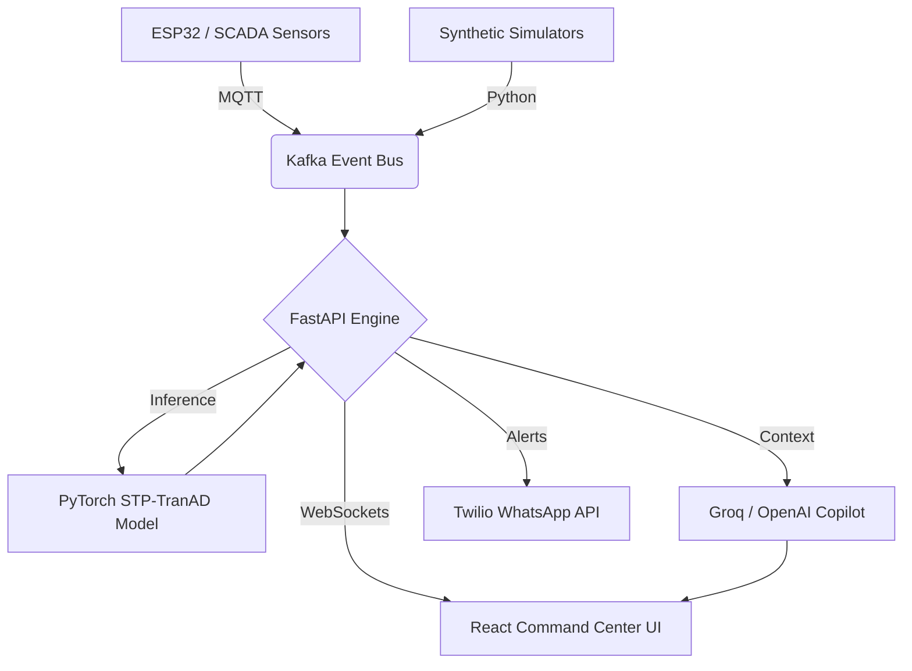

<div align="center">
  
# ⚡ UTAU: Enterprise Predictive Maintenance Command Center
**Spatio-Temporal Predictive AI · Real-Time Digital Twin · AI Copilot · Edge Integration**


> **UTAU** bridges the gap between raw hardware telemetry and high-level autonomous governance. It is a closed-loop, military-grade system for predicting, explaining, and mitigating equipment failure across multiple energy asset domains simultaneously.

</div>

---

## 🌟 Why UTAU? (The Vision)
Current Industrial IoT (IIoT) dashboards are passive and highly theoretical. **UTAU** fundamentally changes this by introducing an **active, AI-driven Command Center**. Featuring a stunningly animated interface, real-time 3D Digital Twins, and an embedded Large Language Model (LLM) Copilot, UTAU doesn't just show you that an anomaly happened—it tells you exactly *why* it happened, *how much revenue is at risk*, and *how to fix it*.

---

## 📸 UI Showcase
> **🚨 ACTION REQUIRED FROM DEVELOPER:** Please take screenshots of your app running locally and place them in an `assets/` folder in the root directory. Replace the filenames below if necessary!

### 1. The Command Center (Digital Twin & HUD)
A high-tech, industrial-grade dashboard featuring a live 3D visualizer of the active asset (Wind Turbine / Solar Array) overlaid with real-time glassmorphism HUDs.
> **Screenshot needed:** Take a full-screen screenshot of the main Dashboard page showing the 3D model, the live signal charts on the left, and the alert cards on the right.
<p align="center">
  
</p>

### 2. The Animated Landing Experience
A cinematic, premium entry point built with `framer-motion` scroll reveals, floating glass cards, and a dynamic typewriter effect that instantly grabs attention.
> **Screenshot needed:** Take a screenshot of the top of the Landing Page (`/landing`), capturing the "ENTER DASHBOARD" button and the floating stat cards.
<p align="center">
  
</p>

### 3. UTAU AI Copilot (SOP Generator)
A floating cybernetic assistant that has direct read-access to the live telemetry stream. Powered by Groq/OpenAI, it generates structured Standard Operating Procedures (SOPs) on the fly.
> **Screenshot needed:** Open the Chatbot Popup on the dashboard, ask it a question about the active anomaly, and take a screenshot of its markdown-formatted response.
<p align="center">
  
</p>

### 4. Executive PDF Reporting
Instant, one-click PDF generation that compiles current system state, active alerts, and revenue loss metrics into a clean, professional template ready for executives.
> **Screenshot needed:** Click the "Export Report" button and take a screenshot of the generated PDF document.
<p align="center">
  
</p>

---

## ✨ Key Features

- 🧠 **SOTA AI Inference (STP-TranAD)**: Fused scoring combining reconstruction loss, forecasting error, and correlation-shift measurements via a custom Spatio-Temporal Transformer (PyTorch).
- 🎮 **3D Digital Twin Interface**: Interactive, WebGL-powered 3D models (Turbines and Solar Panels) that react to system state and anomalies in real time.
- 💬 **Context-Aware AI Copilot**: Ask questions about your telemetry naturally. The Copilot knows exactly what dataset you are viewing, what sensors are failing, and past operator feedback.
- 💸 **Real-Time Revenue Risk**: Quantifies the financial cost of each ongoing anomaly instantly—expected vs. actual power output tracked per asset.
- 📱 **WhatsApp Pager Alerts**: Built-in Twilio integration immediately alerts operators via WhatsApp when critical threshold deviations occur.
- 🏎️ **Zero-Latency WebSocket Engine**: The React UI renders fast, high-density canvas graphs updating dynamically without freezing the DOM.
- 📊 **Executive PDF Exports**: Automatically generates stylized, professional PDF reports of the current dashboard state.

---

## 🏗️ Architecture

Our custom Neural Network architecture outperforms baseline architectures (like standard TranAD, GDN) for time-series anomaly detection by using contextual normalization (e.g. factoring in weather data before judging power output).



---

## 🌞🌬️ Supported Predictive Maintenance Domains

UTAU is highly modular. It ships with generic IIoT capabilities but is hyper-specialized for renewable energy:

| Domain | Dataset Key | Features | Known Fault Types Detected |
|---|---|---|---|
| **☀️ Solar Array** | `solar_synthetic` | 10 | Soiling, Hotspot/Cell Degradation, Inverter Fault |
| **🌪️ Wind Turbine**| `wind_synthetic` | 12 | Gearbox Wear, Bearing Fault, Yaw Misalignment |
| **🏭 Generic IIoT**| `synthetic` | 64 | General multivariate systemic anomalies |

---

## ⚙️ Quick Start Installation

### Prerequisites
- Python 3.10+
- Node.js 18+
- Docker (for Kafka & InfluxDB)
- API Keys: Groq (for Copilot), Twilio (for WhatsApp)

### 1. Infrastructure (Docker)
```bash
# Start Kafka and InfluxDB
docker compose up -d kafka influxdb
```

### 2. Backend (FastAPI + AI Engine)
```bash
cd TranAD-main
python -m venv venv
source venv/bin/activate  # Or `venv\Scripts\activate` on Windows
pip install -r requirements.txt

# Create your .env file
echo "VITE_GROQ_API_KEY=your_key_here" > .env
echo "TWILIO_ACCOUNT_SID=your_key_here" >> .env

# Start the Telemetry Server
python server.py
```

### 3. Start Telemetry Simulator (New Terminal)
```bash
cd TranAD-main
source venv/bin/activate

# Stream live wind turbine data into the pipeline
python kafka_producer.py --dataset wind_synthetic --topic telemetry-stream --hz 2 --loop
```

### 4. Frontend (React + Vite)
```bash
cd Frontend
npm install
npm run dev
# The Command Center is now live at http://localhost:5173 🚀
```

---

## 🔌 Core API Endpoints

- `WS /ws/stream`: Live WebSocket pushing 60fps telemetry vectors and fused anomaly scores.
- `POST /change_dataset`: Hot-swap the active ML model and dataset (`solar_synthetic`, `wind_synthetic`).
- `POST /anomalies/{id}/sop`: Trigger the LLM Copilot to generate a mitigation strategy for a specific incident.
- `GET /api/revenue_loss`: Retrieve real-time financial impact metrics across the entire fleet.

---

<div align="center">
  <i>Engineered for resilience. Built to impress.</i>
</div>
