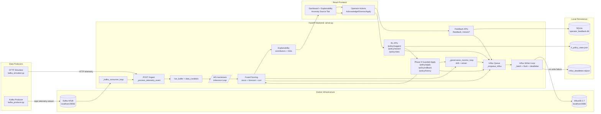

# CATCH STP-TranAD Implementation Context (Phases 1-9)

## 1) Goal and Scope
This project extends baseline TranAD into a production-style streaming anomaly system with:
- robust ingest and dataset hot-swap,
- fused anomaly scoring (reconstruction + forecast + correlation shift),
- explainable alert payloads and investigation UX,
- operator feedback and governance loops,
- optional Kafka ingestion,
- InfluxDB persistence for runtime observability,
- RL-based policy tuning with guarded manual apply, canary checks, and rollback controls.

Primary workspaces:
- TranAD-main: backend server, model code, simulator/producer scripts, backfill tooling.
- Frontend: React dashboard, explainability and anomaly-source tabs, operator actions.

## 2) Runtime Topology
Containerized services are defined in docker-compose.yml:
- kafka (KRaft mode, no ZooKeeper, exposed on localhost:29092)
- influxdb (v2.7, exposed on localhost:8086, dev org/bucket/token bootstrap)

Application processes:
- FastAPI backend (TranAD-main/server.py)
- Frontend Vite app (Frontend)
- data emitter (either HTTP simulator or Kafka producer)

## 3) End-to-End Pipeline Flow

### 3.1 Boot Sequence
1. docker compose up -d kafka influxdb starts broker and time-series DB.
2. Backend startup_event initializes:
   - feedback SQLite schema,
   - model + optimizer + feature dimension,
   - ingestion state and warm buffer,
   - governance task,
   - optional Kafka consumer task,
   - optional Influx async writer task,
   - optional RL policy manager (when feature flag enabled).
3. Frontend connects to WS /ws/stream and polls status APIs.

### 3.2 Data Ingestion Paths
Two supported ingest modes:

Path A: HTTP ingest
- kafka_simulator.py reads dataset arrays and posts to POST /ingest.

Path B: Kafka ingest
- kafka_producer.py sends telemetry JSON to topic telemetry-stream.
- backend _kafka_consumer_loop consumes with aiokafka and forwards each event into the same _process_telemetry_event path used by HTTP.

Both paths converge at _process_telemetry_event:
- timestamp validation (ordering and skew checks),
- dimension validation,
- invalid/NaN imputation from last-known-good values,
- outlier accounting and degraded-mode tagging,
- append sanitized vector to live_buffer,
- notify websocket inference loop via asyncio condition.

### 3.3 Inference and Alert Generation
WS loop behavior in /ws/stream:
1. Wait for newly ingested sample.
2. Build causal window (history -> current point).
3. Run STP_TranAD forward pass:
   - reconstruction outputs x1/x2,
   - forecast head output.
4. Compute component errors:
   - recon_loss from x2 vs current,
   - forecast residual vs actual,
   - correlation shift between window halves.
5. Normalize and fuse components into fused_score.
6. Derive dynamic threshold (percentile after warmup, fallback default before warmup).
7. Decide anomaly flag, severity, confidence, anomaly type, top contributors, similar history, and investigation hints.
8. Push payload to frontend over websocket.

### 3.4 Frontend Operator Loop
Frontend receives websocket payload and renders:
- fused score, threshold, anomaly state,
- actual vs forecast sensors,
- explainability cards and investigation hints,
- anomaly source breakdown (feature-gated).

Operator actions:
- acknowledge/dismiss sends POST /feedback,
- optional calibration request via POST /calibrate,
- retrain lifecycle via GET /retrain/plan and POST /retrain/mark_applied.

### 3.5 Governance Loop
Background task _governance_monitor_loop periodically:
- updates drift metrics from fused score history,
- refreshes retrain recommendation state,
- emits ingest quality snapshots.

Governance state is exposed through GET /status and retrain APIs.

### 3.6 InfluxDB Persistence Flow (Phase 5+)
When INFLUX_ENABLED=true:
1. Backend creates bounded asyncio queue.
2. Runtime events call _enqueue_influx (non-blocking fast path).
3. _influx_writer_loop batches queue items by size/flush interval.
4. Batched writes are sent to InfluxDB.
5. On write failure, payload batch is appended to results/influx_deadletter.ndjson.

Measurements currently emitted:
- anomaly_scores
- anomaly_events
- operator_feedback
- drift_events
- ingest_quality
- policy_events

Backfill (Phase 7):
- scripts/backfill_influxdb.py migrates historical SQLite feedback + checkpoint metadata into:
  - operator_feedback
  - model_training

### 3.7 RL Suggestion Flow (Phase 8)
When FEATURE_RL_POLICY_SUGGESTIONS=true:
1. GET /policy/suggest builds current metric snapshot.
2. RLPolicyManager maps metrics to state bucket, selects action (epsilon-greedy), and returns suggestion.
3. Suggestion is persisted to RL state file and logged as policy_events.
4. POST /policy/reward updates Q-value and clears pending suggestion.
5. GET /policy/stats returns Q-table and action stats.

Safety boundary:
- Suggestions are never auto-applied.
- Apply requires explicit operator call to policy apply APIs.

### 3.8 Guarded Apply and Rollback Flow (Phase 9)
1. Operator requests suggestion via GET /policy/suggest.
2. Operator evaluates proposed deltas using POST /policy/apply with mode=dry_run.
3. Backend enforces hard guardrails on max delta per policy parameter.
4. In canary mode, backend replays recent fused score history and checks alert-rate shift bounds.
5. If checks pass, mode=canary or mode=force applies policy to runtime controls:
   - fused_threshold_default
   - retrain_min_feedback
   - drift_z_threshold
6. Apply events are persisted in memory history and emitted to Influx policy_events.
7. Operator can restore previous policy with POST /policy/rollback.
8. GET /policy/history returns latest apply/rollback audit records.

## 4) Phase-by-Phase Implementation Status

### Phase 1: Ingestion Reliability
- timestamp guards, dimension drop logic, imputation, outlier/degraded tracking, simulator retries.

### Phase 2: Fused Scoring
- recon + forecast + correlation components, positive z-normalization, weighted fusion, dynamic threshold.

### Phase 3: Explainability and Investigation UX
- anomaly type, severity, confidence, contributors, similar anomaly matching, hints, frontend drill-down.

### Phase 4: Adaptive Governance
- SQLite feedback persistence,
- drift monitoring and retrain recommendation,
- guarded calibration with rollback,
- retrain acknowledgement endpoint.

### Phase 5: Influx Runtime Persistence
- Docker Influx service + backend async queue writer + dead-letter file + status telemetry.

### Phase 6: Policy Event Persistence Alignment
- recommendation lifecycle, calibration outcomes, and retrain acknowledgements emitted as policy_events.

### Phase 7: Historical Backfill
- scripts/backfill_influxdb.py added with dry-run, preview, write, verify, and verify-only modes.

### Phase 8: RL Suggestion-Only Policy Loop
- /policy/suggest, /policy/reward, /policy/stats integrated with persistent RL state.

### Phase 9: Guarded Manual Apply and Rollback
- POST /policy/apply supports mode=dry_run, mode=canary, and mode=force.
- Guardrail enforcement for bounded policy deltas.
- Canary replay check on recent fused-score alert-rate shift.
- POST /policy/rollback to restore previous policy snapshot.
- GET /policy/history for auditability.

## 5) Key API Surface (Current)
Core:
- POST /ingest
- GET /status
- POST /change_dataset
- POST /calibrate
- WS /ws/stream

Investigation:
- GET /anomalies
- GET /anomalies/{anomaly_id}

Governance:
- POST /feedback
- GET /feedback/summary
- GET /retrain/plan
- POST /retrain/mark_applied

RL (feature-gated):
- GET /policy/suggest
- POST /policy/reward
- GET /policy/stats
- POST /policy/apply
- POST /policy/rollback
- GET /policy/history

## 6) Configuration Knobs
Important backend env groups:
- ingest reliability: INGEST_*
- fused scoring: FUSED_*
- governance/retrain/calibration: DRIFT_*, RETRAIN_*, CALIBRATE_*
- Kafka: KAFKA_*
- Influx: INFLUX_*
- feature flags: FEATURE_ANOMALY_SOURCE_TAB, FEATURE_RL_POLICY_SUGGESTIONS
- RL parameters: RL_POLICY_*
- Phase 9 policy guards: POLICY_APPLY_*, POLICY_CANARY_*

## 7) Operational Runbook (Local)
1. Start infra:
   - docker compose up -d kafka influxdb
2. Start backend with required flags (Kafka/Influx/RL as needed).
3. Start frontend.
4. Start one producer path:
   - HTTP: python kafka_simulator.py
   - Kafka: python kafka_producer.py --dataset SMD --topic telemetry-stream --hz 1 --loop
5. Validate via GET /status:
   - kafka.connected / counters,
   - influx.connected / queue_size / write_errors,
   - governance + feature flags + rl_policy state.

## 8) Verification Checklist (Current)
1. Stream data and confirm websocket payload updates.
2. Switch datasets (including synthetic) and confirm no shape-crash.
3. Trigger feedback actions and confirm SQLite + status counters.
4. Confirm retrain recommendation lifecycle and mark_applied behavior.
5. Confirm Influx writes increase for anomaly_scores/anomaly_events/ingest_quality/policy_events.
6. Run backfill script and verify model_training/operator_feedback counts.
7. If RL enabled, validate suggest -> reward -> stats sequence.
8. Validate guarded apply flow:
   - dry_run returns guardrail and canary reports,
   - force/canary applies policy when valid,
   - rollback restores previous runtime policy,
   - history records apply and rollback entries.

## 9) Major Files Touched Across Phases
- TranAD-main/server.py
- TranAD-main/src/rl_policy_manager.py
- TranAD-main/scripts/backfill_influxdb.py
- TranAD-main/kafka_simulator.py
- TranAD-main/kafka_producer.py
- TranAD-main/README.md
- docker-compose.yml
- Frontend/src/App.tsx
- Frontend/src/components/AnomalySourceTab.tsx

## 10) Notes
- This context reflects the implemented state through Phase 8.
- This context reflects the implemented state through Phase 9.
- For architecture figure generation prompt, keep using the existing STP_TranAD diagram spec from previous context revisions when needed.

## 11) Mermaid Architecture Diagram

